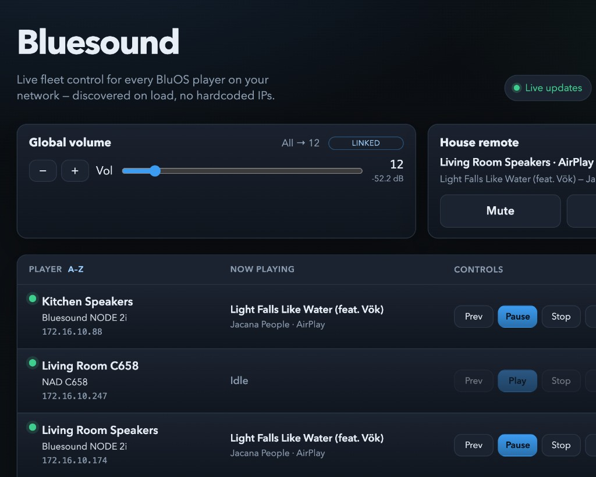

# Bluesound Dashboard

[](https://github.com/tbaur/bluesound-dashboard/actions/workflows/test.yml)
[](LICENSE)
[](https://www.python.org/downloads/)
[](https://nodejs.org/)

Consolidated LAN dashboard for Bluesound / BluOS players (Custom Integration API **v1.7**). Discovers devices on the network (mDNS + LSDP) and exposes playback, volume, queue, inputs, presets, Bluetooth, and multi-room controls through a live web UI.

Related CLI: [bluesound-controller](https://github.com/tbaur/bluesound-controller). This dashboard is self-contained (no runtime dependency on the CLI).



## Features

- **Discovery** on page load, on demand, and automatic re-scan when the fleet is empty
- **Live fleet** via server-side poller + SSE (REST fallback when SSE reconnects)
- **Playback** play / pause / stop / skip / back / toggle
- **Volume** absolute level, relative adjust (+/−), mute (per-player and house-wide)
- **Queue** view / clear / reorder
- **Inputs**, **presets**, **Bluetooth** modes
- **Multi-room groups** create groups, add/remove followers, group all, ungroup all
- **Diagnostics** per-player status + uptime; hard/soft reboot (API)
- **Ops** health / readiness endpoints, structured logs, automated releases — see [docs/RUNBOOK.md](docs/RUNBOOK.md)

## Requirements

- Python 3.10+ (CI: 3.10, 3.13, 3.14)
- Node.js 22+
- Same LAN as your Bluesound players (discovery and control stay on the local network)

## Quick start

Two terminals:

```bash
# Terminal 1 — API
cd backend && python3 -m venv .venv && source .venv/bin/activate
pip install -e ".[dev]" && uvicorn app.main:app --reload --host 127.0.0.1 --port 8000
```

```bash
# Terminal 2 — UI
cd frontend && npm ci && npm run dev
```

Open http://localhost:5173/

Production deploy, health checks, and troubleshooting: [docs/RUNBOOK.md](docs/RUNBOOK.md).

Configuration and network exposure: [docs/CONFIGURATION.md](docs/CONFIGURATION.md) (copy [.env.example](.env.example) to start).

## Docs

- [Configuration](docs/CONFIGURATION.md) — environment variables and network exposure
- [Runbook](docs/RUNBOOK.md) — start, health, failures, logs
- [Changelog](CHANGELOG.md) — version history
- [Security](SECURITY.md) — vulnerability reporting
- [Code of Conduct](CODE_OF_CONDUCT.md)
- [Releasing](RELEASING.md)
- [Contributing](CONTRIBUTING.md)

## License

Copyright 2026 tbaur. Apache License 2.0. See [LICENSE](LICENSE).
