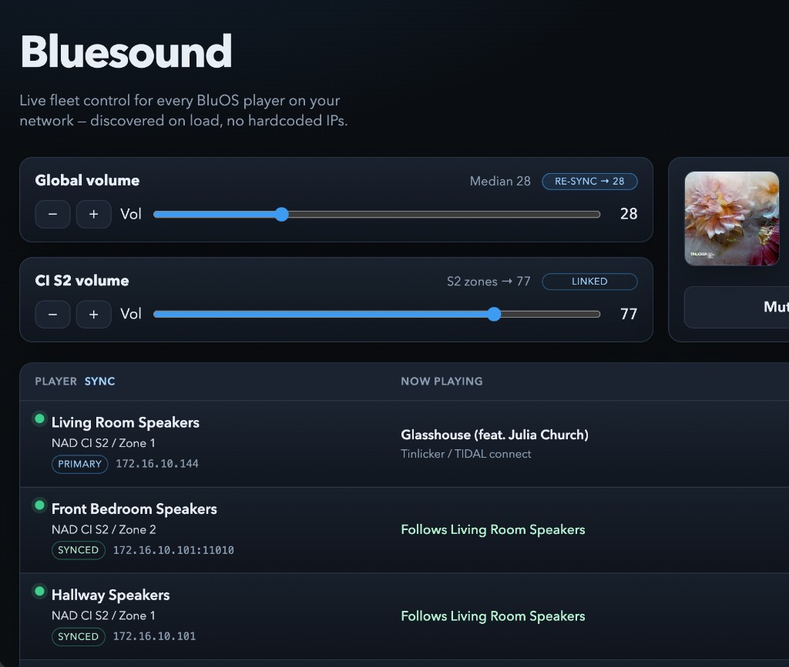

# Bluesound Dashboard

[](https://github.com/tbaur/bluesound-dashboard/actions/workflows/test.yml)
[](LICENSE)
[](https://www.python.org/downloads/)
[](https://nodejs.org/)

Consolidated LAN dashboard for Bluesound / BluOS players (Custom Integration API **v1.7**). Discovers devices on the network (mDNS + LSDP) and exposes multi-device playback, volume, queue, inputs, presets, Bluetooth, and multi-room controls through a live web UI — the house-wide surface Bluesound apps never shipped.

Related CLI: [bluesound-controller](https://github.com/tbaur/bluesound-controller). This dashboard is self-contained (no runtime dependency on the CLI).



## Features

- **Discovery** on page load, on demand, and automatic re-scan when the fleet is empty — mDNS browses `_musc` and `_musp` (CI secondary zones as `ip:port`)
- **Live fleet** via server-side poller + SSE (REST fallback while reconnecting; after prolonged SSE failure, Offline pill + 5s REST poll with SSE retry every 60s)
- **Playback** play / pause / stop / skip / back / toggle
- **Volume** absolute level, relative adjust (+/−), mute (per-player and house-wide); residential **Global volume** and **CI S2 volume** are separate controls (different amp scales)
- **House remote** fleet mute / pause / stop; when one clear house stream dominates, shows track, service, format/bitrate, and album art
- **Queue** view / clear / reorder
- **Inputs**, **presets**, **Bluetooth** modes (unsupported players hide BT; probe failures are not treated as hard errors)
- **Multi-room groups** create groups, add/remove followers, **group all free rooms** under a lead, ungroup one set or **ungroup all**; break all also clears **orphans** whose primary left the network (reparent ungroup)
- **House page** fleet transport, break-all groups, soft/hard reboot all, firmware inventory + upgrade check
- **Player settings** audio/player options (EQ, replay gain, LED, standby, …)
- **Diagnostics** structured per-player status (uptime, signal, network, firmware); hard/soft reboot (API)
- **Ops** health / readiness endpoints, structured logs, automated releases — see [docs/RUNBOOK.md](docs/RUNBOOK.md)

## Requirements

- Python 3.10+ (CI: 3.10, 3.13, 3.14)
- Node.js 22+
- Same LAN as your Bluesound players (discovery and control stay on the local network)

## Quick start

```bash
make install   # backend venv + frontend deps
make run       # API then UI (fails if :8000/:8765 busy; BSD_FORCE_FREE_PORTS=1 to reclaim)
```

Open http://127.0.0.1:8765/ (API listens on http://127.0.0.1:8000/). For LAN binds, set `BSD_API_TOKEN` in the repo-root `.env` and the same value as `VITE_API_TOKEN` in `frontend/.env` (Vite does not read the repo-root file) — see [docs/CONFIGURATION.md](docs/CONFIGURATION.md).

Full setup and checks: [CONTRIBUTING.md](CONTRIBUTING.md). Ops details: [docs/RUNBOOK.md](docs/RUNBOOK.md). Configuration: [docs/CONFIGURATION.md](docs/CONFIGURATION.md) (copy [.env.example](.env.example) to the repo root when needed).

Or two terminals (start UI only after API `/api/v1/healthz` returns 200):

```bash
# Terminal 1 — API
cd backend && python3 -m venv .venv && source .venv/bin/activate
pip install -e ".[dev]" && uvicorn app.main:app --reload --host 127.0.0.1 --port 8000
```

```bash
# Terminal 2 — UI
cd frontend && npm ci && npm run dev
```

## Docs

Keep these aligned when behavior changes (see [CONTRIBUTING.md](CONTRIBUTING.md)):

- [Configuration](docs/CONFIGURATION.md) — `BSD_` variables, discovery, network exposure
- [Runbook](docs/RUNBOOK.md) — start, health, failures, logs
- [Changelog](CHANGELOG.md) — released history (generated by release-please; do not hand-edit for routine releases)
- [Security](SECURITY.md) — supported versions and vulnerability reporting
- [Code of Conduct](CODE_OF_CONDUCT.md)
- [Releasing](RELEASING.md)
- [Contributing](CONTRIBUTING.md)

## License

Copyright 2026 tbaur. Apache License 2.0. See [LICENSE](LICENSE).
