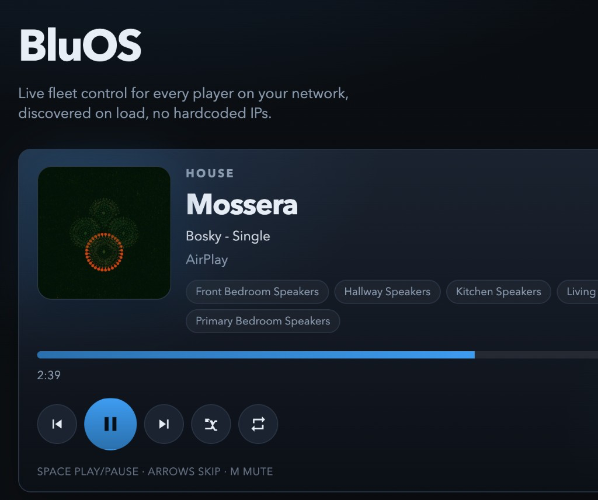

# BluOS Dashboard

[](https://github.com/tbaur/bluos-dashboard/actions/workflows/test.yml)
[](LICENSE)
[](https://www.python.org/downloads/)
[](https://nodejs.org/)

LAN dashboard for every BluOS player on your network — Nodes, Pulse, NAD CI zones, and the rest. It discovers the fleet (mDNS + LSDP), then keeps house-wide playback, volume, and grouping live in the browser. Custom Integration API **v1.7**.

Related CLI: [bluos-controller](https://github.com/tbaur/bluos-controller). This dashboard is self-contained (no runtime dependency on the CLI).



## Features

- **House remote** — artwork, title/album/source, rooms on the stream, live seek, skip, shuffle/repeat, mute, and stop all. Space play/pause, arrows skip, M mute. When rooms are on different sources, pick which stream the remote drives.
- **Fleet** — every player, live now-playing, A–Z or clustered by sync group (auto-switches to Sync when a group forms).
- **Volume** — **Bluesound** (Nodes/Pulse) and **NAD CI S2** are separate sliders (different amp scales). CI S2 also has 42 / 50 / 60 / 70 chips.
- **Multi-room** — create groups, add/remove followers, group all free rooms under a lead, ungroup one set or all. Break-all also clears orphans whose primary left the network.
- **Per player** — queue, inputs, presets, Bluetooth, audio/player settings, diagnostics (including uptime), 12-hour presence, reboot.
- **House page** — same remote, poller drop history (this process), firmware inventory + upgrade check, reboot all, ungroup all.
- **Discovery** — on load, on rescan, and automatic re-scan when the fleet is empty. mDNS browses `_musc` and `_musp` (CI secondary zones as `ip:port`).
- **Live updates** — server poller + SSE, with REST fallback if the stream drops.

Ops (health, logs, LAN bind): [docs/RUNBOOK.md](docs/RUNBOOK.md).

## Requirements

- Python 3.10+ (CI: 3.10, 3.13, 3.14)
- Node.js 22+
- Same LAN as your players

## Quick start

```bash
make install   # backend venv + frontend deps
make run       # API then UI (fails if :8000/:8765 busy; BSD_FORCE_FREE_PORTS=1 to reclaim)
```

Open http://127.0.0.1:8765/ (API on http://127.0.0.1:8000/).

For a LAN bind, set `BSD_API_TOKEN` in the repo-root `.env` and the same value as `VITE_API_TOKEN` in `frontend/.env` (Vite does not read the repo-root file). Copy [.env.example](.env.example) when you need non-default settings.

Full setup and checks: [CONTRIBUTING.md](CONTRIBUTING.md). Two-terminal start: [docs/RUNBOOK.md](docs/RUNBOOK.md). Variables: [docs/CONFIGURATION.md](docs/CONFIGURATION.md).

## Docs

- [Configuration](docs/CONFIGURATION.md) — `BSD_` variables, discovery, network exposure
- [Runbook](docs/RUNBOOK.md) — start, health, failures, logs
- [Changelog](CHANGELOG.md) — released history (generated by release-please)
- [Security](SECURITY.md)
- [Code of Conduct](CODE_OF_CONDUCT.md)
- [Releasing](RELEASING.md)
- [Contributing](CONTRIBUTING.md)

## License

Copyright 2026 tbaur. Apache License 2.0. See [LICENSE](LICENSE).
